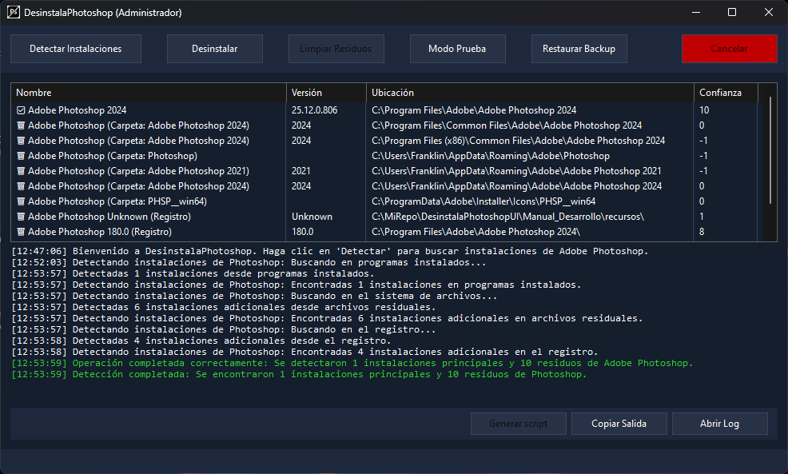
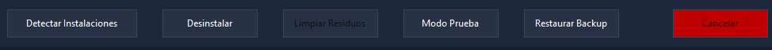
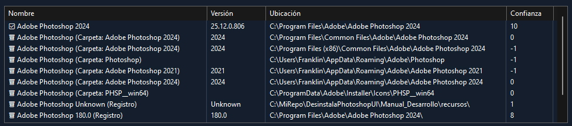
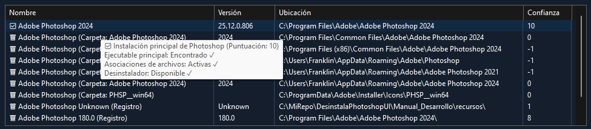
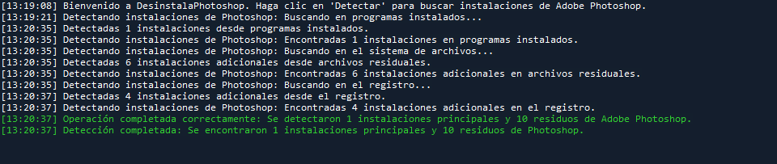
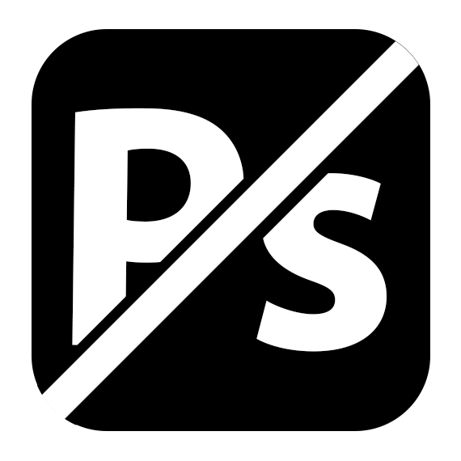

# Descripción Visual de la Interfaz Gráfica

## Tema y Esquema de Colores

La aplicación DesinstalaPhotoshop utiliza un tema oscuro moderno que proporciona una experiencia visual agradable y reduce la fatiga visual durante sesiones prolongadas. Este tema oscuro está implementado a nivel de sistema mediante la API de temas de Windows Forms.

### Implementación del Tema Oscuro

El tema oscuro se aplica en el punto de entrada de la aplicación (Program.cs) mediante la llamada a `Application.SetColorMode(SystemColorMode.Dark)`:

```csharp
namespace DesinstalaPhotoshop.UI
{
    internal static class Program
    {
        [STAThread]
        static void Main()
        {
            // Configuración de la aplicación
            ApplicationConfiguration.Initialize();

            // Aplicar tema oscuro
            Application.SetColorMode(SystemColorMode.Dark);

            // Iniciar la aplicación
            Application.Run(new MainForm());
        }
    }
}
```

⚠️ **Nota importante**: La API de tema oscuro (`SetColorMode`) es una característica experimental en .NET 9, por lo que el compilador genera advertencias al utilizarla. Para suprimir estas advertencias y habilitar el acceso a la API, es necesario agregar el siguiente `PropertyGroup` al archivo del proyecto (.csproj):

```xml
<PropertyGroup>
    <NoWarn>$(NoWarn);WFO5001;WFO5002</NoWarn>
</PropertyGroup>
```

Esta configuración permite utilizar la API de temas sin generar advertencias durante la compilación, manteniendo la funcionalidad deseada.

### Colores Principales

- **Color de fondo principal**: Azul oscuro profundo `Color.FromArgb(20, 30, 45)`
- **Color de paneles secundarios**: Azul oscuro medio `Color.FromArgb(30, 40, 60)`
- **Color de texto principal**: Blanco `Color.White`
- **Colores de acento**:
  - Verde lima para mensajes de éxito `Color.LimeGreen`
  - Amarillo para advertencias `Color.Yellow`
  - Rojo para errores `Color.Red`
  - Gris para mensajes de depuración `Color.Gray`

## Estructura y Distribución

La interfaz gráfica está organizada en una estructura jerárquica clara que facilita la navegación y el uso de la aplicación. La ventana principal tiene un tamaño mínimo de 800x600 píxeles y se inicia centrada en la pantalla.



> *Captura de pantalla que muestra la interfaz principal completa con la lista de instalaciones y la consola de salida.*

### Componentes Principales

1. **Panel Superior (panelTop)**
   - Ubicado en la parte superior de la ventana
   - Contiene los botones principales de acción
   - Fondo azul oscuro medio `Color.FromArgb(30, 40, 60)`
   - Anclado al borde superior (Dock = Top)

2. **Panel Principal (panelMain)**
   - Ocupa la mayor parte de la ventana
   - Contiene un control SplitContainer que divide el espacio en dos secciones:
     - **Panel Superior**: Lista de instalaciones detectadas
     - **Panel Inferior**: Consola de salida

3. **Panel de Estado (panelStatus)**
   - Ubicado en la parte inferior de la ventana
   - Contiene la barra de progreso y etiqueta de estado
   - Visible solo durante operaciones en curso

4. **Panel de Consola (panelConsole)**
   - Contiene el área de texto para mostrar mensajes de log
   - Incluye un panel inferior con botones relacionados con la consola

## Elementos Visuales Clave

### Botones de Acción Principal

Los botones principales están ubicados en el panel superior y tienen un diseño consistente:





> *Captura de pantalla que muestra los botones principales en el panel superior de la aplicación.*

- **Detectar Instalaciones (btnDetect)**
  - Inicia el proceso de detección de instalaciones de Photoshop
  - Siempre habilitado

- **Desinstalar (btnUninstall)**
  - Desinstala la instalación seleccionada
  - Habilitado solo cuando hay una instalación principal o posible instalación principal seleccionada
  - Incluye tooltip explicativo que cambia según el contexto

- **Limpiar Residuos (btnCleanup)**
  - Elimina archivos y entradas de registro residuales
  - Habilitado solo cuando no hay instalaciones principales pero sí hay residuos detectados
  - Incluye tooltip explicativo que cambia según el contexto

- **Modo de Prueba (btnTestMode)**
  - Permite simular operaciones sin realizar cambios reales
  - Siempre habilitado

- **Cancelar (btnCancel)**
  - Cancela la operación en curso
  - Habilitado solo durante operaciones en curso
  - Texto en color blanco para asegurar visibilidad `ForeColor = Color.White`

- **Restaurar (btnRestore)**
  - Permite restaurar copias de seguridad
  - Habilitado cuando hay copias de seguridad disponibles

### Lista de Instalaciones

La lista de instalaciones (lstInstallations) muestra las instalaciones detectadas con un diseño detallado:


> *Captura de pantalla que muestra la lista de instalaciones con ejemplos de instalaciones principales, posibles instalaciones principales y residuos.*

- **Modo de visualización**: Vista de detalles (View.Details)
- **Selección**: Fila completa (FullRowSelect = true)
- **Columnas**:
  - Nombre (345 píxeles de ancho)
  - Versión (100 píxeles de ancho)
  - Ubicación (410 píxeles de ancho)
  - Confianza (80 píxeles de ancho)

### Indicadores Visuales

La aplicación utiliza emojis como indicadores visuales para distinguir entre diferentes tipos de instalaciones:

- **✅ Marca de verificación verde**: Indica una instalación principal confirmada
- **⚠️ Señal de advertencia**: Indica una posible instalación principal que requiere verificación
- **🗑️ Papelera**: Indica residuos de una instalación anterior

Estos emojis aparecen tanto en la lista de instalaciones como en los tooltips detallados, proporcionando una indicación visual inmediata del tipo de cada elemento.

### Tooltips Informativos

La aplicación hace un uso extensivo de tooltips para proporcionar información contextual:



> *Captura de pantalla que muestra un tooltip detallado al pasar el cursor sobre una instalación en la lista.*

- **Tooltips en la lista de instalaciones**: Muestran información detallada sobre cada instalación, incluyendo:
  - Tipo de instalación con emoji correspondiente
  - Puntuación de confianza
  - Estado del ejecutable principal (✓/✗)
  - Estado de las asociaciones de archivos (✓/✗)
  - Disponibilidad del desinstalador (✓/✗)

- **Tooltips en botones**: Explican la función de cada botón y por qué podría estar deshabilitado:
  - "Desinstalar la instalación principal seleccionada"
  - "No hay instalaciones principales detectadas para desinstalar"
  - "No se pueden limpiar residuos mientras exista una instalación principal"
  - "No se detectaron residuos para limpiar"

## Consola de Salida

La consola de salida (txtConsole) proporciona información detallada sobre las operaciones en curso:



> *Captura de pantalla que muestra la consola con mensajes de diferentes tipos (información, éxito, advertencia, error) y los botones relacionados.*

- **Fuente**: Consolas, 9 puntos (fuente monoespaciada ideal para consolas)
- **Colores de texto**:
  - Blanco para información normal
  - Verde lima para mensajes de éxito
  - Amarillo para advertencias
  - Rojo para errores
  - Gris para mensajes de depuración
- **Formato de mensajes**: `[HH:mm:ss] Mensaje`
- **Controles relacionados**:
  - Botón para copiar el contenido al portapapeles
  - Botón para generar scripts de limpieza
  - Botón para abrir la carpeta de logs

## Indicadores de Progreso

La aplicación proporciona retroalimentación visual sobre el progreso de las operaciones:


> *Captura de pantalla que muestra la barra de progreso y la etiqueta de estado durante una operación en curso.*

- **Barra de progreso (progressBar)**:
  - Estilo continuo (ProgressBarStyle.Continuous)
  - Visible solo durante operaciones en curso
  - Muestra el porcentaje de completado

- **Etiqueta de progreso (lblProgress)**:
  - Muestra la operación actual y el porcentaje
  - Incluye animación de texto durante la fase inicial (0%)
  - Formato: "Operación actual - XX%"

## Adaptabilidad

La interfaz está diseñada para ser adaptable:

- **Tamaño mínimo**: 800x600 píxeles
- **Redimensionamiento**: Los paneles se ajustan proporcionalmente al cambiar el tamaño de la ventana
- **Anclaje**: Los paneles principales están anclados a los bordes correspondientes (Dock property)
- **SplitContainer**: Permite al usuario ajustar la proporción entre la lista de instalaciones y la consola

## Diálogos Personalizados con CustomMsgBoxLibrary

La aplicación utiliza la biblioteca `CustomMsgBoxLibrary` para todos sus diálogos modales, ofreciendo una estética moderna y personalizable que se integra perfectamente con el tema oscuro de la aplicación.


> *Nota: Las capturas de pantalla actuales muestran la funcionalidad pero la estética de los diálogos es ahora mejorada por `CustomMsgBoxLibrary`. Se recomienda actualizar las capturas `Screenshot_02.png`, `Screenshot_03.png`, `Screenshot_05.png`, `Screenshot_06.png`, `Screenshot_07.png` para mostrar los nuevos diálogos personalizados.*

### Características de los Diálogos Personalizados

- **Tema Consistente**: Los diálogos utilizan el mismo esquema de colores que la aplicación principal.
- **Iconos Modernos**: Iconos vectoriales de alta calidad para diferentes tipos de mensajes.
- **Botones Personalizados**: Estilo visual consistente con el resto de la aplicación.
- **Animaciones Suaves**: Transiciones y efectos visuales para mejorar la experiencia de usuario.
- **Adaptabilidad**: Ajuste automático del tamaño según el contenido del mensaje.

### Tipos de Diálogos

- **Diálogos de Información**: Para mostrar mensajes informativos al usuario.
- **Diálogos de Advertencia**: Para alertar sobre acciones potencialmente peligrosas.
- **Diálogos de Error**: Para notificar errores o problemas.
- **Diálogos de Confirmación**: Para solicitar confirmación antes de realizar acciones importantes.
- **Diálogos de Progreso**: Para mostrar el progreso de operaciones largas.

Para más detalles sobre la personalización y uso de estos diálogos, consulte la documentación de `CustomMsgBoxLibrary.md` en la carpeta `recursos/`.

## Elementos de Identidad

- **Título de la ventana**: "DesinstalaPhotoshop" (con indicador de administrador cuando corresponde)
- **Posición inicial**: Centrada en la pantalla (StartPosition = FormStartPosition.CenterScreen)

### Icono de la Aplicación

La aplicación utiliza un icono personalizado que representa visualmente su propósito. Este icono se utiliza tanto para la ventana de la aplicación como para el archivo ejecutable cuando se publica.



> *Imagen del icono de la aplicación en alta resolución.*

#### Características del Icono

- **Nombre del archivo**: `app.ico` (ubicado en la carpeta Resources del proyecto)
- **Diseño**: Representa el concepto de eliminación/desinstalación de Photoshop
- **Formato**: Archivo ICO estándar de Windows con múltiples resoluciones

> **Nota**: El icono se ha incluido en la carpeta `recursos` de este manual para referencia. Puede encontrarlo en `Manual_Desarrollo/recursos/app.ico`.

#### Implementación en el Código

El icono se carga en el formulario principal durante la inicialización:

```csharp
private void SetupControls()
{
    // Establecer el icono del formulario
    try
    {
        this.Icon = Resources.AppIcon;
    }
    catch (Exception ex)
    {
        // Si hay algún error al cargar el icono, lo registramos pero continuamos
        Console.WriteLine($"Error al cargar el icono: {ex.Message}");
    }

    // Resto de la configuración...
}
```

#### Configuración en el Proyecto

Para que el icono se aplique también al archivo ejecutable cuando se publica la aplicación, se debe configurar en el archivo del proyecto (.csproj):

```xml
<PropertyGroup>
    <OutputType>WinExe</OutputType>
    <TargetFramework>net9.0-windows</TargetFramework>
    <Nullable>enable</Nullable>
    <UseWindowsForms>true</UseWindowsForms>
    <ImplicitUsings>enable</ImplicitUsings>
    <ApplicationIcon>Resources\app.ico</ApplicationIcon>
    <NoWarn>$(NoWarn);WFO5001;WFO5002</NoWarn>
    <ApplicationManifest>app.manifest</ApplicationManifest>
</PropertyGroup>
```

La línea `<ApplicationIcon>Resources\app.ico</ApplicationIcon>` especifica el icono que se utilizará para el ejecutable generado.

#### Uso del Icono en Nuevos Proyectos

Para utilizar este icono en un nuevo proyecto:

1. Copiar el archivo `app.ico` a la carpeta Resources del proyecto
2. Agregar la referencia en el archivo .csproj como se muestra arriba
3. Cargar el icono en el código del formulario principal
4. Asegurarse de que el icono esté incluido como recurso embebido en el proyecto
